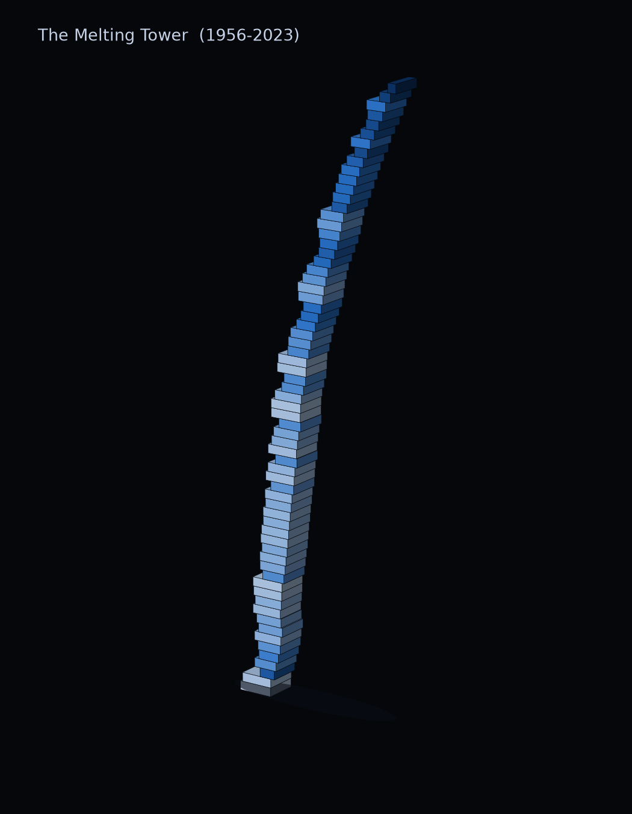
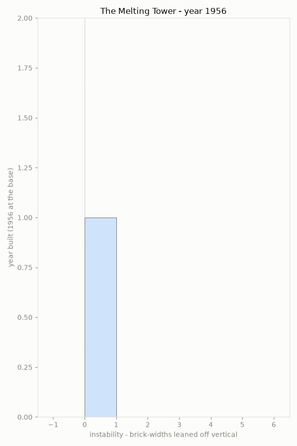

# The Melting Tower





## The phenomenon

Every year since 1956, scientists have measured how much mass a set of "reference"
glaciers around the world have gained or lost, and added that number to a running
total. The total only ever goes down: by 2023 it had fallen from 0 to almost -30
metres of water equivalent. This project takes that one number, year by year, and
draws it as a tower built brick by brick, where each year's data physically
determines how the tower stands: how far it leans, how deep the bite taken out of
its base is, how dark that brick is, and how hard the whole structure shudders when
it lands.

## The source

[World Glacier Monitoring Service reference-glacier mass balance record, mirrored
by datasets/glacier-mass-balance](https://raw.githubusercontent.com/datasets/glacier-mass-balance/master/data/glaciers.csv),
itself republished from the US EPA's "Climate Change Indicators" series. The file
has 68 rows, one per year from 1956 to 2023, with the year, the cumulative mean
mass balance in metres of water equivalent, and the number of glaciers observed
that year.

## What the picture shows

Every brick's position comes directly from its row: how far it leans is that
year's *cumulative* loss; the bite out of its base and its color are both that
year's *own* loss (cumulative[i] − cumulative[i-1]); the shake when it lands uses
the same annual-loss number as its amplitude. Nothing about the shape is
decorative — it is what "foundation pulled out from under it" looks like when
every pull is an actual measurement. It is rendered as solid, lit blocks floating
in a dark void with the camera slowly turning around them, rather than as a flat
chart with axes and gridlines, because the tower is meant to be looked at as a
structure, not read as a plot — but the camera turn and the void are staging: they
show the same numbers from more angles, and add or hide none of them.

What it hides: the lean's scale (how many brick-widths per metre of water
equivalent) is an artistic choice, not a physical unit conversion. These are
*reference* glaciers, a monitored subset chosen for having long, continuous
records — not every glacier on Earth. And the number of glaciers observed climbs
from 12 in the 1950s to over 60 by the 2020s, so part of why the early decades
look calmer is that fewer glaciers were being watched, not necessarily that less
was happening.

## Run it

```
uv run fetch.py
uv run plot.py
```
